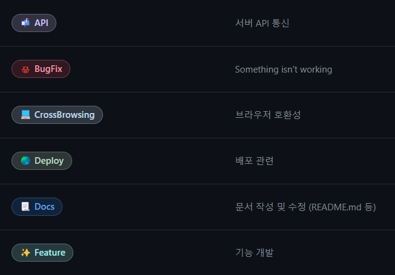
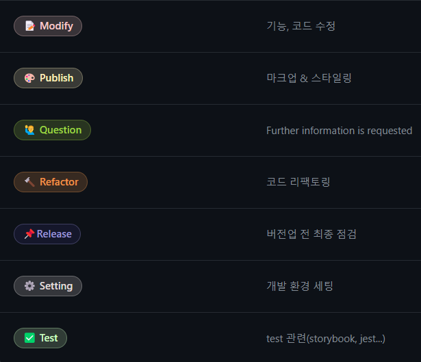

> **_“멘보샤처럼 맛있게, 당신만의 멘토링”_**

멘보샤는 누구나 자유롭게 멘토링을 하거나 받을 수 있는 커뮤니티 입니다. <br>

1대1 실시간 채팅과 리뷰 시스템을 기반으로 쾌적한 멘토링 서비스를 제공합니다 😀


## 페이지 소개

| 메인                                                                                                                | 로그인(소셜)                                                                                                        | 멘토 찾기                                                                                                           | 멘토 프로필                                                                                                         |
| ------------------------------------------------------------------------------------------------------------------- | ------------------------------------------------------------------------------------------------------------------- | ------------------------------------------------------------------------------------------------------------------- | ------------------------------------------------------------------------------------------------------------------- |
|  |  |  |  |
| 멘보샤 홈페이지                                                                                                     | 소셜 로그인 모달                                                                                                    | 멘토들의 목록 페이지                                                                                                | 멘토의 프로필을 열람하는 페이지                                                                                     |

| 멘토 게시판                                                                                                         | 멘토 게시글                                                                                                         | 도와주세요 게시판                                                                                                   | 도와주세요 게시글                                                                                                   |
| ------------------------------------------------------------------------------------------------------------------- | ------------------------------------------------------------------------------------------------------------------- | ------------------------------------------------------------------------------------------------------------------- | ------------------------------------------------------------------------------------------------------------------- |
|  |  |  |  |
| 멘토들의 정보 공유 페이지                                                                                           | 멘토들이 쓴 게시글                                                                                                  | 멘티들의 도와주세요 게시글 리스트                                                                                   | 도움이 필요한 사람의 게시글                                                                                         |

| 게시글 작성                                                                                                         | 신고하기                                                                                                            | 리뷰하기                                                                                                            | 채팅페이지                                                                                                          |
| ------------------------------------------------------------------------------------------------------------------- | ------------------------------------------------------------------------------------------------------------------- | ------------------------------------------------------------------------------------------------------------------- | ------------------------------------------------------------------------------------------------------------------- |
|  |  |  |  |
| 멘토 게시글과 도와주세요 게시글을 작성 가능                                                                         | 유저 신고를 위한 모달                                                                                               | 채팅 후 후기 작성 모달,                                                                                             | 1:1 채팅 페이지                                                                                                     |

| 나의 프로필                                                                                                         | 나의 랭크                                                                                                           | 나의 후기                                                                                                           | 나의 기록                                                                                                           |
| ------------------------------------------------------------------------------------------------------------------- | ------------------------------------------------------------------------------------------------------------------- | ------------------------------------------------------------------------------------------------------------------- | ------------------------------------------------------------------------------------------------------------------- |
|  |  |  |  |
| 본인 프로필 확인과 편집 페이지                                                                                      | 본인의 랭크와 뱃지 확인 페이지                                                                                      | 본인이 받은 후기 확인 페이지                                                                                        | 본인이 쓴 게시글 확인 페이지                                                                                        |

| 마이 페이지                                                                                                         | 고객지원                                                                                                            | 자주하는 질문                                                                                                       | 회원탈퇴                                                                                                            |
| ------------------------------------------------------------------------------------------------------------------- | ------------------------------------------------------------------------------------------------------------------- | ------------------------------------------------------------------------------------------------------------------- | ------------------------------------------------------------------------------------------------------------------- |
|  |  |  |  |
| 마이페이지를 한 눈에 보는 페이지                                                                                    | 웹사이트 고객지원 페이지                                                                                            | 웹 사이트의 궁금한 점을 보는 페이지                                                                                 | 회원탈퇴 페이지                                                                                                     |

## 개발 기간

- 23.12.01 ~ 24.03.17
- 베타 테스트 기간 : 24.03.18 ~ 24.04.01

### 멤버구성

- Back-End
  <table>
    <tr>
      <td align="center"><a href="https://github.com/hobiJeong"><br /><sub><b>정비호</b></sub></a><br /><a href="https://github.com/hobiJeong" title="Packaging/porting to new platform">백엔드 팀원</a></td>
      <td align="center"><a href="https://github.com/2swo"><br /><sub><b>이승우</b></sub></a><br /><a href="https://github.com/2swo" title="Packaging/porting to new platform">백엔드 팀장</a></td>
      <td align="center"><a href="https://github.com/NicoDora"><br /><sub><b>박준혁</b></sub></a><br /><a href="https://github.com/NicoDora" title="Packaging/porting to new platform">부회장</a></td>
    </tr>
  </table>
- Front-End
  <table>
    <tr>
      <td align="center"><a href="https://github.com/CBWDG"><br /><sub><b>원동건</b></sub></a><br /><a href="https://github.com/CBWDG" title="Packaging/porting to new platform">프론트엔트 팀장</a></td>
      <td align="center"><a href="https://github.com/zzzRYT"><br /><sub><b>이재진</b></sub></a><br /><a href="https://github.com/zzzRYT" title="Packaging/porting to new platform">회장</a></td>
    </tr>
  </table>
- Design
  <table>
    <tr>
      <td align="center"><a href="https://www.notion.so/b4290c8ff0b34e4aac8c8f90847fea7e?p=aa597a24bf3d44ffa4e5b3cb1c31591a&pm=c"><br /><sub><b>송치욱</b></sub></a><br /><a href="https://www.notion.so/b4290c8ff0b34e4aac8c8f90847fea7e?p=aa597a24bf3d44ffa4e5b3cb1c31591a&pm=c" title="Packaging/porting to new platform">디자인 팀원</a></td>
      <td align="center"><a href="https://www.notion.so/b4290c8ff0b34e4aac8c8f90847fea7e?p=a017cfe72081459ab912a91dda6bf16b&pm=c"><br /><sub><b>정현민</b></sub></a><br /><a href="https://www.notion.so/b4290c8ff0b34e4aac8c8f90847fea7e?p=a017cfe72081459ab912a91dda6bf16b&pm=c" title="Packaging/porting to new platform">디자인 팀원</a></td>
      <td align="center"><a href="https://www.notion.so/b4290c8ff0b34e4aac8c8f90847fea7e?p=179166cce3b64819adb353b2f05a2454&pm=c"><br /><sub><b>정효준</b></sub></a><br /><a href="https://www.notion.so/b4290c8ff0b34e4aac8c8f90847fea7e?p=179166cce3b64819adb353b2f05a2454&pm=c" title="Packaging/porting to new platform">디자인 팀장</a></td>
    </tr>
  </table>

## 기술 스택<p>

<h3 align="center">  
  Language & Tools
</h3>
<p align="center" style="text-decoration: none;">
  <a href="https://developer.mozilla.org/ko/docs/Web/HTML" >
    
  </a>
  <a href="https://devdocs.io/css/">
    
  </a>
  <a href="https://sass-lang.com/">
    
  </a>
  <a href="https://www.typescriptlang.org/">
    
  </a>
  <a href="https://code.visualstudio.com/">
    
  </a>
  <a href="https://nodejs.org/en">
    
  </a>
</p>

<h3 align="center">  
  FrameWork & Library
</h3>

<p align="center" style="text-decoration: none;">
  <a href="https://nextjs.org/">
    
  </a>
  <a href="https://ko.legacy.reactjs.org/">
    
  </a>
  <a href="https://socket.io/">
    
  </a>
  <a href="https://mswjs.io/">
    
  </a>
  <a href="https://axios-http.com/kr/docs/intro">
    
  </a>
  <a href="https://styled-components.com/">
    
  </a>
</p>

<h3 align="center">  
  Global-State
</h3>

<p align="center" style="text-decoration: none;">
  <a href = "https://recoiljs.org/ko/">
    
  </a>
</p>

<h3 align="center">  
  Module-Bundler
</h3>

<p align="center" style="text-decoration: none;">
  <a href="https://webpack.kr/">
    
  </a>
</p>

<h3 align="center">  
  Cooperation
</h3>

<p align="center" style="text-decoration: none;">
  <a href="https://eslint.org/">
    
  </a>
  <a href="https://prettier.io/">
    
  </a>
  <a href="https://www.dotenv.org/docs/">
    
  </a>
</p>

<h3 align="center">  
  Communication
</h3>

<p align="center" style="text-decoration: none;">
  <a href="https://git-scm.com/">
    
  </a>
  <a href="https://github.com/">
    
  </a>
  <a href="https://docs.github.com/ko/actions">
    
  </a>
  <a href="https://slack.com/intl/ko-kr/">
    
  </a>
  <a href="https://www.notion.so/ko-kr">
    
  </a>
  <a href="https://discord.com/">
    
  </a>
  <a href="https://www.figma.com/">
    
  </a>
</p>

---

### 커밋 메시지 컨벤션

```
  git commit -m "feat(#123):커밋 내용"
```

`feat(#이슈번호): 커밋내용`

<figure style="display:flex">

</figure>

### 브랜치 전략

- `feature/기능이름/(#이슈번호)`
- 이슈 생성 시 자동 브랜치 생성

### 폴더,파일 작성 전략

- 디자인패턴 : Atomic Design Pattern
- 구분

```
  name : 폴더(소문자로만, 구분은 '-')
  [name].ts/tsx : 동적경로
  name.ts/tsx : 파일
  Name.tsx : 컴포넌트
```

- 폴더구조
  ```markup
  ├─ public
  |   ├─ fonts
  │   └─ images
  |
  └─ src
      ├─ apis
      │    ├─ axiosInstance.ts : axios라이브러리 인스턴스
      │    └─ [endpoint_url].ts : 벡엔드와 합의한 엔드폰인트
      ├─ components
      │   ├─ common : 자주사용되는 기능
      │   │   ├─ index.ts
      │   │   └─ [componentName]
      │   │        ├─ styled.tsx
      │   │        ├─ index.ts
      │   │        └─ [componentName].tsx
      │   ├─ molecules : 하나의 기능
      │   ├─ organisms : 여러기능 집합
      │   └─ templates : 집합이 모여 하나의 페이지구성
      ├─ hooks
      │  └─ use[hookName]
      │      ├─ [hookName].tsx
      │      └─ index.ts
      ├─ pages
      │   ├─ index.tsx : root페이지
      │   ├─ _app.tsx
      │   ├─ _document.tsx
      │   └─ [each_page]
      │         └─ index.tsx
      ├─ recoil : 전역상태관리
      │    ├─ atoms
      │    │   └─ userAtom.ts
      │    └─ selectors
      │        └─ userSelector.ts
      ├─ styles
      │     └─ globals.css
      │
      └─ types
            └─ [type].d.ts : 타입 정의파일
  ```
- dependencies
  ```json
    "@types/react-slick": "^0.23.12",
    "@types/slick-carousel": "^1.6.40",
    "axios": "^1.6.2",
    "dotenv": "^16.3.1",
    "env-cmd": "^10.1.0",
    "next": "14.0.3",
    "prettier": "^3.1.0",
    "react": "^18",
    "react-dom": "^18",
    "react-fast-marquee": "^1.6.4",
    "react-quill": "^2.0.0",
    "react-slick": "^0.29.0",
    "react-slider": "^2.0.6",
    "recoil": "^0.7.7",
    "recoil-persist": "^5.1.0",
    "slick-carousel": "^1.8.1",
    "socket.io-client": "^4.7.4",
    "styled-components": "^6.1.1"
  ```
- 폴더 :
  - `post-board`
  - `기능-요소` 순으로 작성
- 파일
  - `.tsx` : UpperCamelCase으로 작성
  - `.ts` : CamleCase작성
